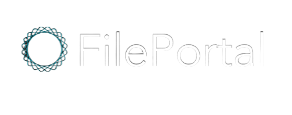

<h1><picture>
  
</picture></h1>

FilePortal is a **free, open-source file transfer server** where users can instantaneously send files of any size. On FilePortal, users can transfer anything they want: links, pictures, text, video. 

Follow along with the quick tutorial below:

<picture>
  
</picture>

## Features

### Real-time, quick file transfer

Allows to you connect with another person on another desktop and will quickly transfer the file to the person in real time

### Transfer any size file of many different types

Supports many different file types such as jpeg, png, pdf, zip, etc. Additionally, will transfer any size file no matter how big.

## Deployment

### Tech stack:

- **C++** powers the back end server
- **React.js** powers the front end 
- **Node.js** helps communication between the front end and back end 

### Requirements:

- **C++** 20+
- **React.js** 18+
- **Node.js** 15+

## Contributing

FilePortal is **free, open-source software** licensed under **MIT**.

You can open issues for bugs you've found or features you think are missing, and can also submit pull requests to this repository. 

## License

MIT License

Copyright (c) 2023 Zain Piyarali, Mikael Siddiqui, Darek Chominski

Permission is hereby granted, free of charge, to any person obtaining a copy
of this software and associated documentation files (the "Software"), to deal
in the Software without restriction, including without limitation the rights
to use, copy, modify, merge, publish, distribute, sublicense, and/or sell
copies of the Software, and to permit persons to whom the Software is
furnished to do so, subject to the following conditions:

The above copyright notice and this permission notice shall be included in all
copies or substantial portions of the Software.

THE SOFTWARE IS PROVIDED "AS IS", WITHOUT WARRANTY OF ANY KIND, EXPRESS OR
IMPLIED, INCLUDING BUT NOT LIMITED TO THE WARRANTIES OF MERCHANTABILITY,
FITNESS FOR A PARTICULAR PURPOSE AND NONINFRINGEMENT. IN NO EVENT SHALL THE
AUTHORS OR COPYRIGHT HOLDERS BE LIABLE FOR ANY CLAIM, DAMAGES OR OTHER
LIABILITY, WHETHER IN AN ACTION OF CONTRACT, TORT OR OTHERWISE, ARISING FROM,
OUT OF OR IN CONNECTION WITH THE SOFTWARE OR THE USE OR OTHER DEALINGS IN THE
SOFTWARE.